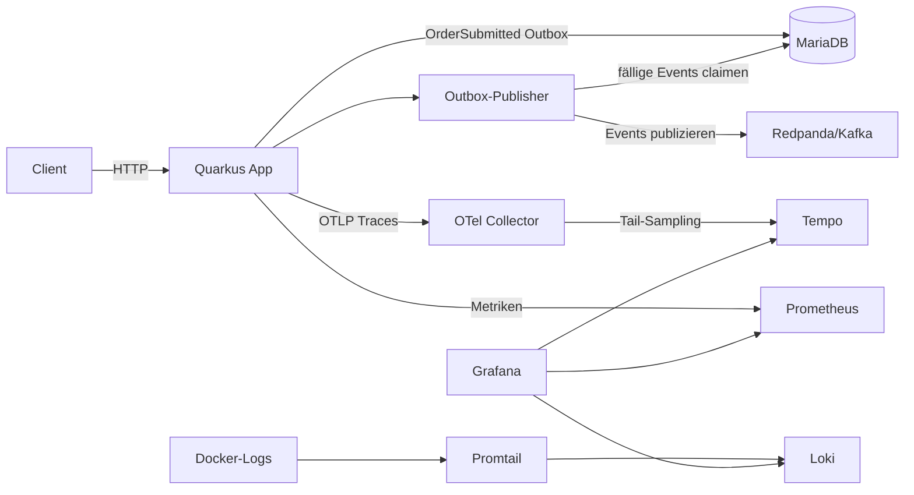
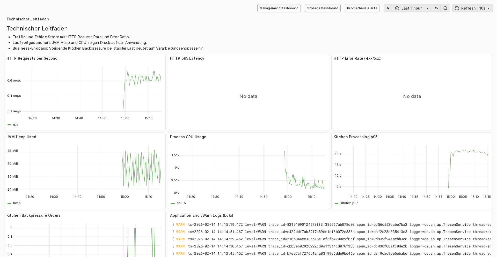
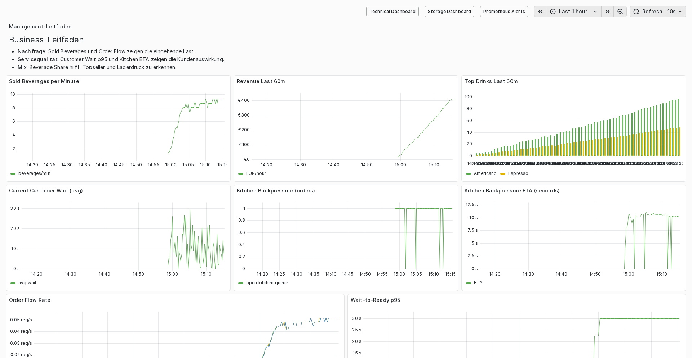
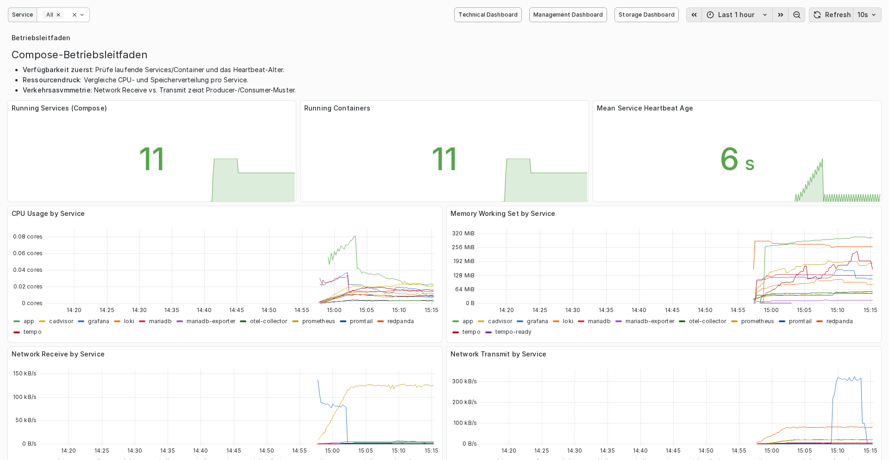
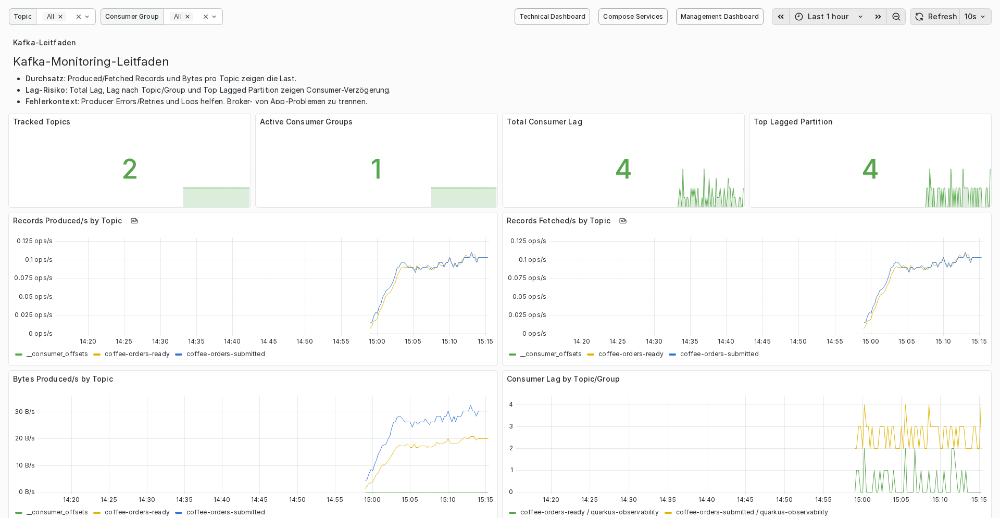
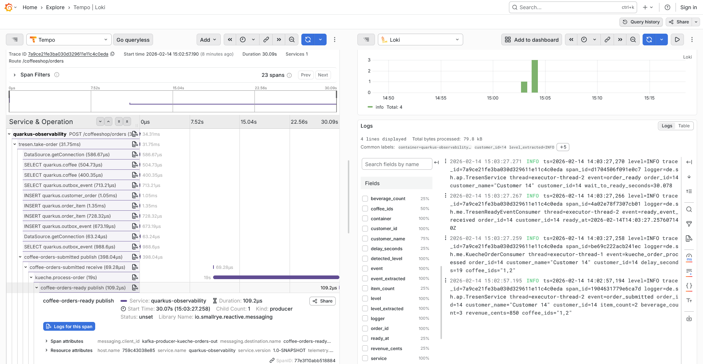

# Quarkus Observability Demo

Dieses Repository zeigt eine durchgängige Observability-Referenz für eine Quarkus-Anwendung mit Traces, Metriken und Logs auf Basis eines lokalen Docker-Compose-Stacks.

## Architekturüberblick

Die zentrale Architektur besteht aus folgenden Komponenten:

- **`app` (Quarkus):** erzeugt OpenTelemetry-Traces und sendet sie per **OTLP HTTP** an den Collector.
- **`otel-collector`:** nimmt Traces entgegen, führt **Tail-Sampling** anhand von Regeln aus und exportiert ausgewählte Traces weiter.
- **`tempo`:** speichert Traces.
- **`prometheus`:** erfasst Metriken von **App, OTel Collector, MariaDB-Exporter, cAdvisor und Redpanda**.
- **`loki` + `promtail`:** sammeln und speichern Logs (inkl. `trace_id`/`span_id` aus dem Log-Format).
- **`grafana`:** zentrale Oberfläche für Traces, Metriken, Logs und Korrelation.

### Schnellstart-Diagramm



## Schnellstart für Entwickler

1. Stack starten:

```bash
docker compose up --build
```

2. Relevante UIs/Ports:

- App-API: <http://localhost:8080>
- Grafana: <http://localhost:3000>
- Prometheus: <http://localhost:9090>
- Tempo-API/Health: <http://localhost:3200>

3. Beispiel-Flow (Bestellung -> Trace -> Logs):

- Bestellung erzeugen (Beispiel):

```bash
curl -i -X POST http://localhost:8080/coffeeshop/orders \
  -H 'Content-Type: application/json' \
  -d '{
    "customerName": "Max Mustermann",
    "items": [
      {"coffeeId": 1, "quantity": 1}
    ]
  }'
```

- In **Grafana** (Explore / Tempo) nach dem erzeugten Trace suchen (z. B. über Service `quarkus-observability` oder Endpunkt `/coffeeshop/orders`).
- Aus dem gefundenen Trace die `trace_id` übernehmen und in **Grafana** (Explore / Loki) die Logs dazu filtern, z. B. mit `trace_id="..."`.

4. Optional: Last-/Demo-Flow automatisch auslösen:

```bash
./scripts/load-coffeeshop.sh
```

## Grafana-Screenshots

### Technical Overview



### Management Overview



### Compose Services Overview



### Kafka Topics Overview



### Traces (Grafana Explore / Tempo)



## Durchgängiger Telemetriepfad

Der Datenfluss im System:

1. **App -> OTel Collector**
   - Quarkus instrumentiert Requests/Spans und exportiert Traces per OTLP HTTP (`quarkus.otel.exporter.otlp.traces.protocol=http/protobuf`) an den Collector.
2. **OTel Collector -> Tempo**
   - Der Collector empfängt Traces, wendet Tail-Sampling-Regeln (Fehler, Latenz, Business-Endpunkte, technische Endpunkte, probabilistisch) an und exportiert nach Tempo.
3. **App/Infra -> Prometheus**
   - Prometheus scrapt Metriken aus App und Infrastruktur-Komponenten.
4. **Container-Logs -> Promtail -> Loki**
   - Promtail liest Docker-Logs, extrahiert u. a. `trace_id` und `span_id` und schreibt nach Loki.
5. **Grafana als Auswertungsschicht**
   - Grafana nutzt Tempo, Loki und Prometheus als Datasources und ermöglicht die Korrelation von Trace, Logs und Metriken.

## Zustellungssemantik (Outbox-Hybrid)

Damit DB-Persistenz und Kafka-Publish robust gekoppelt sind, verwendet die App eine **transactional outbox**:

- Bestellung + Outbox-Event werden in derselben DB-Transaktion gespeichert.
- Nach erfolgreichem Commit wird ein sofortiger Dispatch ausgelöst.
- Zusätzlich läuft ein adaptives Fallback-Polling (inkl. Retry/Backoff, `SKIP LOCKED`).
- Kafka-Producer läuft mit robusten Settings (`acks=all`, idempotence), Consumer mit DLQ-Strategie.

Relevante Implementierung:

- `src/main/java/de/shellnuts/application/OrderOutboxService.java`
- `src/main/java/de/shellnuts/application/OrderOutboxPublisher.java`
- `src/main/java/de/shellnuts/persistence/OutboxEventRepository.java`

## Übernahme ins eigene Projekt

### Minimale Quarkus-Properties für OpenTelemetry

```properties
quarkus.otel.enabled=true
quarkus.otel.traces.enabled=true
quarkus.otel.traces.sampler=always_on
quarkus.otel.exporter.otlp.traces.protocol=http/protobuf
quarkus.otel.exporter.otlp.traces.endpoint=http://otel-collector:4318
```

### Logging-Format mit `trace_id` / `span_id`

Für Log/Trace-Korrelation sollte das Log-Format Trace-Kontext enthalten:

```properties
quarkus.log.console.format=ts=%d{yyyy-MM-dd HH:mm:ss,SSS} level=%p trace_id=%X{traceId} span_id=%X{spanId} logger=%c{2.} thread=%t %s%e%n
```

### API-Validierung und Fehlerformat

- Anfrage-Validierung erfolgt über Bean Validation direkt am API-Contract.
- Fehlerantworten folgen `application/problem+json` (RFC7807-ähnlich) mit Feldern wie `type`, `title`, `status`, `detail`, `instance`.
- Bei Constraint-Verletzungen wird zusätzlich `violations` zurückgegeben.

### Empfehlung: Head- + Tail-Sampling kombinieren

- **Head-Sampling in der App:** `always_on`, damit alle potenziell relevanten Traces den Collector erreichen.
- **Tail-Sampling im Collector:** Entscheidungen anhand von Regeln treffen (z. B. Fehler immer behalten, langsame Traces behalten, Business-Endpunkte priorisieren, technische Endpunkte herunter-samplen).
- Die Tail-Sampling-Regeln werden zentral im Collector gepflegt und können ohne App-Codeänderung angepasst werden.

## Weiterführende Doku und Konfiguration

- Runbook: [`docs/runbooks/observability-slo.md`](docs/runbooks/observability-slo.md)
- Konfigurationsreferenz (zentrale Properties, Design-Hinweise, Copy/Paste-Checkliste): [`docs/observability/config-reference.md`](docs/observability/config-reference.md)
- Docker-Konfigurationen:
  - [`docker/otel-collector/otel-collector.yaml`](docker/otel-collector/otel-collector.yaml)
  - [`docker/prometheus/prometheus.yml`](docker/prometheus/prometheus.yml)
  - [`docker/tempo/tempo.yaml`](docker/tempo/tempo.yaml)
  - [`docker/loki/loki-config.yaml`](docker/loki/loki-config.yaml)
  - [`docker/promtail/promtail-config.yml`](docker/promtail/promtail-config.yml)
  - [`docker/grafana/provisioning/datasources/datasources.yaml`](docker/grafana/provisioning/datasources/datasources.yaml)
  - [`docker/grafana/provisioning/dashboards/dashboards.yaml`](docker/grafana/provisioning/dashboards/dashboards.yaml)
